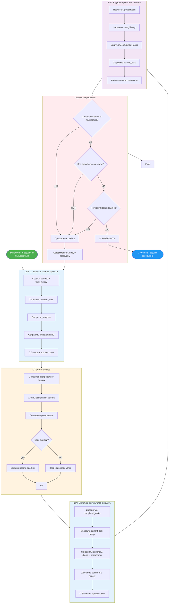

# Блок-схема: От получения задачи до финиша

## Визуальная схема процесса (Mermaid)



---

## Текстовое описание блок-схемы

### 🟢 ЭТАП 1: ПОЛУЧЕНИЕ ЗАДАЧИ
```
┌─────────────────────────────────────┐
│  📥 Пользователь даёт задачу        │
│     "Создай сайт-визитку"           │
└──────────────┬──────────────────────┘
               │
               ▼
┌─────────────────────────────────────┐
│  ШАГ 1: Запись в память проекта     │
│  ─────────────────────────────      │
│  ✓ Создать запись в task_history    │
│  ✓ Установить current_task          │
│  ✓ Статус: "in_progress"            │
│  ✓ Сохранить timestamp и ID         │
│  ✓ 💾 Записать в project.json       │
└──────────────┬──────────────────────┘
               │
               ▼
```

### 🟡 ЭТАП 2: РАБОТА АГЕНТОВ
```
┌─────────────────────────────────────┐
│  🤖 Conductor распределяет задачу   │
│     между агентами                  │
└──────────────┬──────────────────────┘
               │
               ▼
┌─────────────────────────────────────┐
│  Агенты выполняют работу:           │
│  • Пишут код                        │
│  • Создают файлы                    │
│  • Тестируют                        │
└──────────────┬──────────────────────┘
               │
               ▼
        ┌──────────────┐
        │ Есть ошибки? │
        └──────┬───────┘
               │
      ┌────────┴────────┐
      │                 │
      ▼                 ▼
   ┌─────┐           ┌─────┐
   │ ДА  │           │ НЕТ │
   └──┬──┘           └──┬──┘
      │                 │
      ▼                 ▼
┌──────────┐      ┌──────────┐
│ Записать │      │ Записать │
│ ошибки   │      │ успех    │
└────┬─────┘      └────┬─────┘
     │                 │
     └────────┬────────┘
              │
              ▼
```

### 🔵 ЭТАП 3: ЗАПИСЬ РЕЗУЛЬТАТОВ
```
┌─────────────────────────────────────┐
│  ШАГ 2: Запись результатов в память │
│  ───────────────────────────────    │
│  ✓ Добавить в completed_tasks       │
│  ✓ Обновить статус current_task     │
│    (completed / failed)             │
│  ✓ Сохранить:                       │
│    • summary                        │
│    • файлы                          │
│    • артефакты                      │
│    • ошибки (если есть)             │
│  ✓ Добавить событие в history       │
│  ✓ 💾 Записать в project.json       │
└──────────────┬──────────────────────┘
               │
               ▼
```

### 🟣 ЭТАП 4: ДИРЕКТОР ПРОВЕРЯЕТ
```
┌─────────────────────────────────────┐
│  ШАГ 3: Директор читает контекст    │
│  ──────────────────────────────     │
│  ✓ Прочитать project.json           │
│  ✓ Загрузить:                       │
│    • task_history                   │
│    • completed_tasks                │
│    • current_task                   │
│  ✓ Анализ полного контекста         │
└──────────────┬──────────────────────┘
               │
               ▼
```

### 🔴 ЭТАП 5: ПРИНЯТИЕ РЕШЕНИЯ
```
        ┌──────────────────────────┐
        │ ❓ Задача выполнена      │
        │    полностью?            │
        └──────────┬───────────────┘
                   │
          ┌────────┴────────┐
          │                 │
          ▼                 ▼
       ┌─────┐           ┌─────┐
       │ НЕТ │           │ ДА  │
       └──┬──┘           └──┬──┘
          │                 │
          │                 ▼
          │        ┌──────────────────────┐
          │        │ Все артефакты на     │
          │        │ месте?               │
          │        └──────────┬───────────┘
          │                   │
          │          ┌────────┴────────┐
          │          │                 │
          │          ▼                 ▼
          │       ┌─────┐           ┌─────┐
          │       │ НЕТ │           │ ДА  │
          │       └──┬──┘           └──┬──┘
          │          │                 │
          │          │                 ▼
          │          │        ┌──────────────────────┐
          │          │        │ Нет критических      │
          │          │        │ ошибок?              │
          │          │        └──────────┬───────────┘
          │          │                   │
          │          │          ┌────────┴────────┐
          │          │          │                 │
          │          │          ▼                 ▼
          │          │       ┌─────┐           ┌─────┐
          │          │       │ НЕТ │           │ ДА  │
          │          │       └──┬──┘           └──┬──┘
          │          │          │                 │
          │          │          │                 │
          │          │          │                 ▼
          │          │          │        ┌────────────────┐
          │          │          │        │ ✅ ЗАВЕРШИТЬ   │
          │          │          │        │   РАБОТУ       │
          │          │          │        └───────┬────────┘
          │          │          │                │
          │          │          │                ▼
          │          │          │        ┌────────────────┐
          │          │          │        │ 🏁 ФИНИШ       │
          │          │          │        │ Задача завершена│
          │          │          │        └────────────────┘
          │          │          │
          ▼          ▼          ▼
┌─────────────────────────────────────┐
│  🔄 ПРОДОЛЖИТЬ РАБОТУ               │
│  ────────────────────────           │
│  ✓ Сформировать новую подзадачу     │
│  ✓ Вернуться к ШАГУ 1               │
│  ✓ Записать в память                │
└─────────────────────────────────────┘
```

---

## Ключевые точки контроля

| Точка | Что проверяем | Где записано |
|-------|--------------|--------------|
| **A** | Задача получена и записана | `task_history`, `current_task` |
| **B** | Агенты завершили работу | `completed_tasks` |
| **C** | Результаты сохранены | `project.json` |
| **D** | Директор прочитал контекст | Вся память проекта |
| **E** | Решение: продолжить/завершить | На основе анализа всех данных |

---

## Пример трассировки одной задачи

```
1. 📥 ЗАДАЧА: "Создай файл README.md"
   ↓
2. 💾 ЗАПИСЬ В ПАМЯТЬ:
   {
     "task_id": "task_001",
     "status": "in_progress",
     "description": "Создай файл README.md",
     "timestamp": "2024-01-15T10:00:00Z"
   }
   ↓
3. 🤖 АГЕНТЫ РАБОТАЮТ:
   - Agent пишет код
   - Создаёт файл README.md
   ↓
4. 💾 ЗАПИСЬ РЕЗУЛЬТАТОВ:
   {
     "task_id": "task_001",
     "status": "completed",
     "summary": "Файл создан успешно",
     "files_created": ["README.md"],
     "artifacts": {...}
   }
   ↓
5. 📖 ДИРЕКТОР ЧИТАЕТ:
   - task_history: [task_001]
   - completed_tasks: [task_001]
   - current_task: {status: "completed"}
   ↓
6. ❓ РЕШЕНИЕ:
   - Задача выполнена? → ДА
   - Файл на месте? → ДА
   - Ошибок нет? → ДА
   ↓
7. 🏁 ФИНИШ: Задача завершена
```

---

## Правила для директора

### ✅ Продолжать работу если:
- Задача выполнена не полностью
- Есть недостающие артефакты
- Обнаружены критические ошибки
- Нужна дополнительная проверка

### 🏁 Завершать работу если:
- Все требования выполнены
- Все артефакты созданы и проверены
- Нет критических ошибок
- Пользователь получил результат

---

## Визуальный ключ

| Цвет | Значение |
|------|----------|
| 🟢 Зелёный | Начало / Входные данные |
| 🟡 Жёлтый | Процесс работы агентов |
| 🔵 Синий | Запись в память |
| 🟣 Фиолетовый | Чтение контекста |
| 🔴 Красный | Принятие решения |
| ⬜ Белый | Конец / Финиш |
